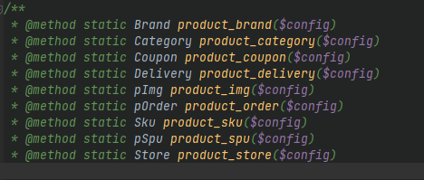

#微信小程序——商业能力——交易组件API
##接口支持标准版以及自定义版
本composer插件基于thinkphp框架使用

###标准版使用实例如下：
```php
require 'vendor\autoload.php';
$config = require 'config\weshop.php';  #引用配置文件

$brand = \sffi\weshop\Factory::product_brand($config);
$res = $brand->reqGet();
var_dump($res); //本处输出品牌信息
```


使用Factory::product_* 均为标准版接口

###自定义版使用实例如下：
```php
require 'vendor\autoload.php';
$config = require 'config\weshop.php';

$sss = \sffi\weshop\Factory::shop_account($config);
$res = $sss->reqGetBrandList();
var_dump($res);  //本处输出品牌信息
```

更多内容请查看源码....